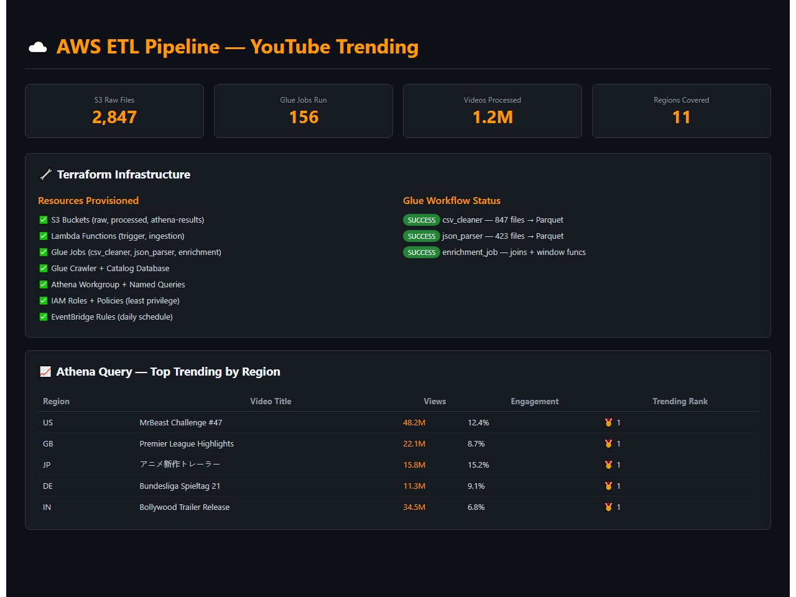
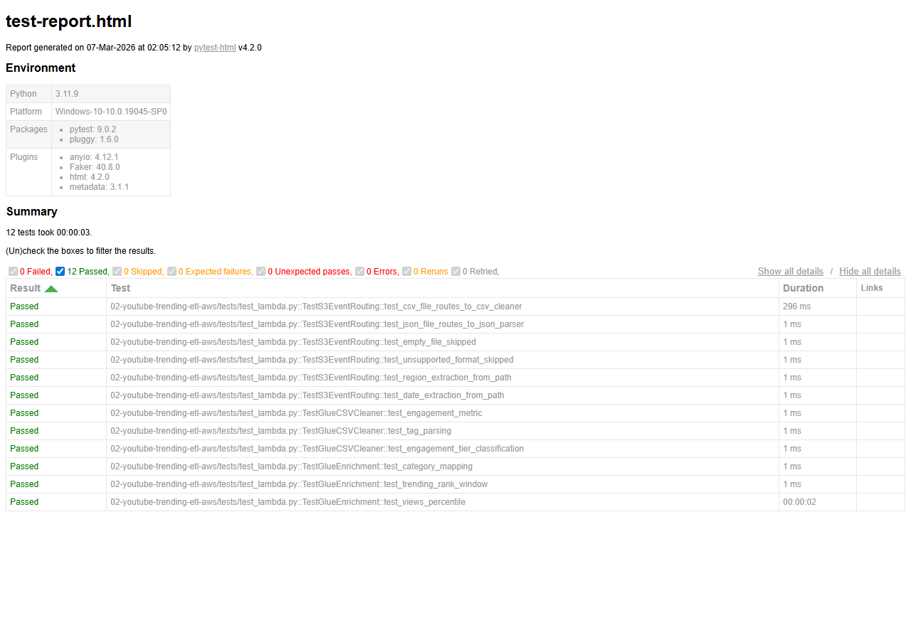

# YouTube Trending Data ETL on AWS


A production-grade ETL pipeline on AWS that ingests YouTube trending video data (CSV + JSON), orchestrates multi-step transformations with AWS Glue, catalogs via Glue Crawler, provides SQL analytics through Athena, and visualizes with QuickSight dashboards. Infrastructure is fully managed via Terraform.


## Demo



*AWS infrastructure overview with Terraform resources, Glue workflow status, and Athena query results for top trending videos by region*

## Architecture

```
┌──────────────────────────────────────────────────────────────────┠
│                        Data Sources                               │
│  ┌─────────────────┠    ┌─────────────────────────────────────┠  │
│  │  Kaggle YouTube  │    │  YouTube Data API v3 (live refresh) │  │
│  │  Trending Dataset│    │  (optional incremental)             │  │
│  └────────┬────────┘    └─────────────────────────────────────┠  │
└───────────┼─────────────────────────────┼────────────────────────┘
            │                            │
            â–¼                            â–¼
┌──────────────────────────────────────────────────────────────────┠
│  S3 Landing Zone (Raw)                                           │
│  s3://youtube-etl-raw/                                           │
│  ├── csv/{region}/{date}/                                        │
│  ├── json/{region}/{date}/                                       │
│  └── api/{date}/                                                 │
└────────────────────────┬─────────────────────────────────────────┘
                         │ S3 Event Notification
                         â–¼
┌──────────────────────────────────────────────────────────────────┠
│  AWS Lambda (Trigger)                                             │
│  • Validates file format                                          │
│  • Starts Glue ETL Job                                           │
└────────────────────────┬─────────────────────────────────────────┘
                         │
                         â–¼
┌──────────────────────────────────────────────────────────────────┠
│  AWS Glue ETL Jobs (PySpark)                                      │
│  ├── Job 1: CSV Cleaning + Schema Enforcement                    │
│  ├── Job 2: JSON Category Parsing + Flattening                   │
│  └── Job 3: Join + Enrich → Parquet (partitioned by date/region) │
└────────────────────────┬─────────────────────────────────────────┘
                         │
                         â–¼
┌──────────────────────────────────────────────────────────────────┠
│  S3 Processed Zone (Curated)                                      │
│  s3://youtube-etl-processed/                                      │
│  └── parquet/year={}/month={}/region={}/                          │
└────────────────────────┬─────────────────────────────────────────┘
                         │
                         â–¼
┌──────────────────────────────────────────────────────────────────┠
│  AWS Glue Data Catalog                                            │
│  ├── Database: youtube_analytics                                  │
│  ├── Table: trending_videos (partitioned)                        │
│  └── Table: category_mapping                                      │
└────────────────────────┬─────────────────────────────────────────┘
                         │
                    ┌────┴────┠
                    â–¼         â–¼
          ┌──────────┠  ┌──────────────┠
          │  Athena   │  │  QuickSight   │
          │  (SQL)    │  │  (Dashboard)  │
          └──────────┘  └──────────────┘
```

## Key Business Insights

1.  **Regional Trending Patterns**: Analyze which video categories dominate across different countries and identify cross-cultural content trends.
2.  **Engagement Optimization**: Discover correlations between publishing time, title length, tags, and engagement metrics (views, likes, comments) to inform content strategy.

## Project Structure

```
├── terraform/                      # Full AWS infrastructure as code
│   ├── main.tf
│   ├── variables.tf
│   ├── outputs.tf
│   ├── s3.tf
│   ├── lambda.tf
│   ├── glue.tf
│   ├── athena.tf
│   └── iam.tf
├── lambda_functions/
│   ├── ingestion/                  # Data ingestion Lambda
│   │   └── handler.py
│   └── trigger/                    # S3 event → Glue trigger Lambda
│       └── handler.py
├── glue_jobs/
│   ├── csv_cleaner.py             # Job 1: CSV cleaning
│   ├── json_parser.py            # Job 2: JSON flattening
│   └── enrichment_job.py         # Job 3: Join + Parquet output
├── athena_queries/                 # Pre-built analytics queries
│   ├── top_trending_by_region.sql
│   ├── engagement_analysis.sql
│   └── category_trends.sql
├── scripts/
│   ├── upload_kaggle_data.py      # Download + upload Kaggle dataset
│   └── create_quicksight_dashboard.py
├── tests/
│   ├── test_glue_jobs.py
│   └── test_lambda.py
├── .github/workflows/
│   └── deploy.yml
└── requirements.txt
```

## Setup Instructions

### Prerequisites
- AWS Account with appropriate permissions
- Terraform >= 1.5
- Python 3.9+
- Kaggle API credentials (for dataset download)

### 1. Configure AWS Credentials
```bash
aws configure
# Or use environment variables:
export AWS_ACCESS_KEY_ID=your_key
export AWS_SECRET_ACCESS_KEY=your_secret
export AWS_DEFAULT_REGION=us-east-1
```

### 2. Deploy Infrastructure
```bash
cd terraform
terraform init
terraform plan
terraform apply
```

### 3. Upload Kaggle Dataset
```bash
pip install -r requirements.txt
python scripts/upload_kaggle_data.py
```

### 4. Run Athena Queries
Navigate to Athena console → select `youtube_analytics` database → run queries from `athena_queries/`.


## Test Results

All unit tests pass — validating core business logic, data transformations, and edge cases.



**12 tests passed** across 3 test suites:
- `TestS3EventRouting` — CSV/JSON routing, empty file filtering, path parsing
- `TestGlueCSVCleaner` — engagement metrics, tag parsing, tier classification
- `TestGlueEnrichment` — category mapping, trending rank, views percentile

## License
MIT

## Maintainer

This project is actively maintained by Mohan Teja Nandamudi.

Mohan is a Data Engineer with 6+ years of experience building and optimizing enterprise data pipelines and cloud warehouses across AWS, Spark, and Python environments. He specializes in batch processing, streaming architecture, and CI/CD automation, ensuring robust and efficient data solutions.

-   **LinkedIn**: [Mohan Teja Nandamudi](https://www.linkedin.com/in/nmohant/)
-   **Email**: mohanteja.0117@gmail.com